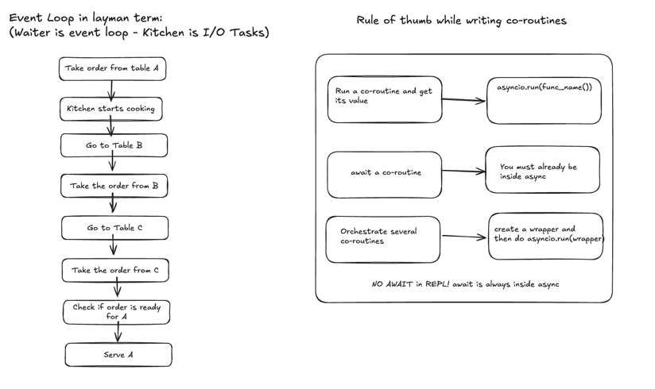
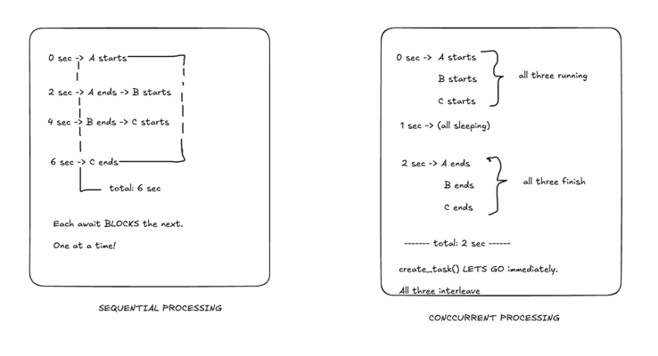
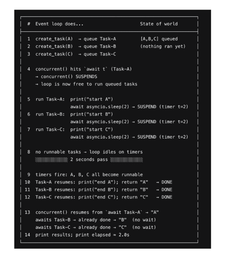

# Core python concepts:

## Event loop in python:

It's a mechanism that repeatedly checks for any asynchronous tasks that are ready to make progress
and executes their corresponding co-routine(s) or task(s).

In python 'asyncio' is responsible for coordinating asynchronous operation.

Important idea here is that "One event loop can manage asynchronous tasks without creating a thread for every task"

The waiter doesnt sit idle waiting.

Refer event_loop.py for code snippets.

## Co-routines:
A co-routine is ansynchronous computation in python by an "async def" function, whose execution can be suspended 

or resumed at "await" points. It returns a "co-routine object"

## Tasks:

A Task is an object that wraps a coroutine and schedules it 

to run on the event loop as soon as possible, independently of the current coroutine.

(Refer the code base for example)
